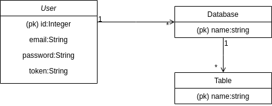

# lankinen-db

[Demo](https://lankinen-db.herokuapp.com/)

Simple to setup relational database administration tool.

- Do the most common actions in simple GUI (create table, add row, modify columns, etc.)
- Access your databases via API



```
CREATE TABLE User (id int, email string, password string, token string)
CREATE TABLE Database (name string)
CREATE TABLE Table (name string)
```

## Getting Started

In the right corner of the page there is a register button. An account requires email and password. Email is not verified. All actions in the website requires user.

## Running Locally

Install all required packages by running following code in the root directory.

```
pip install -r requirements.txt
```

Start the program by running the followign code in the root directory.

```
python run.py
```

## Hosting on Heroku

First to add the project to Heroku.

```
heroku config:set HEROKU=1
```

In Heroku it's recommended to use PostgreSQL.

```
heroku pg:psql
heroku addons:add heroku-postgresql:hobby-dev
```
